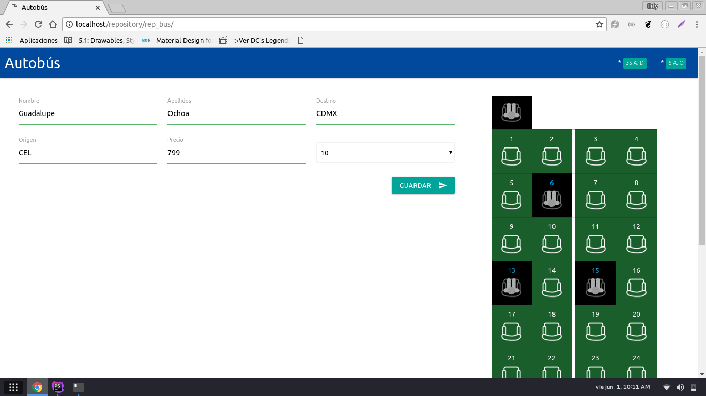
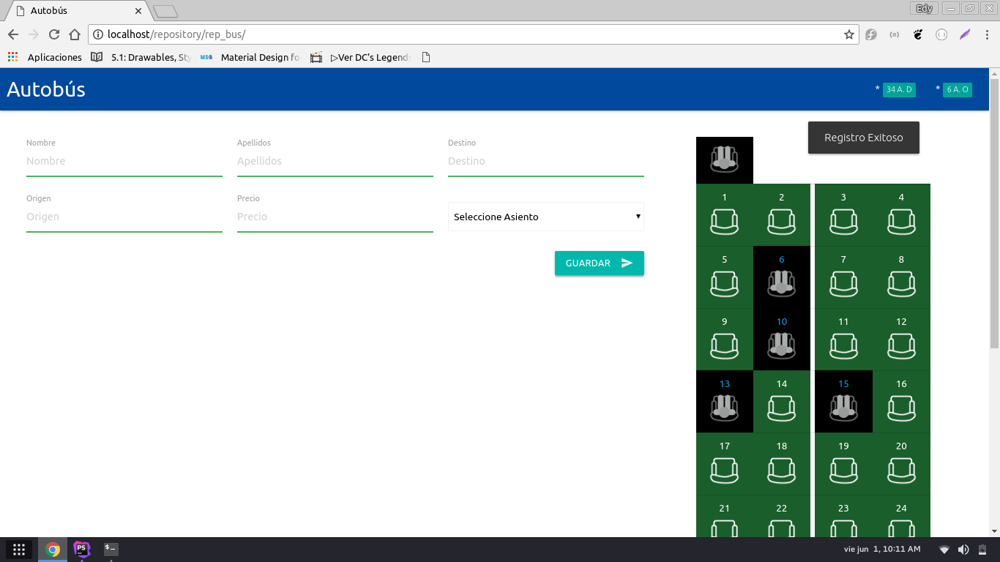
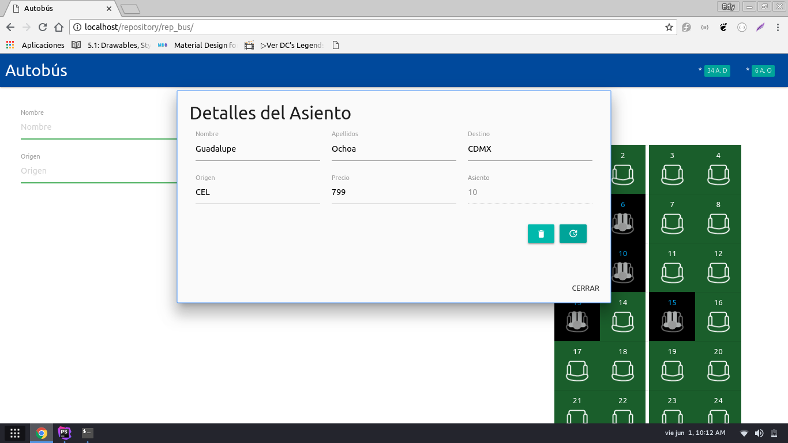

### Simulador de Autobús de Pasajero [PHP-AJAX-MATERIALIZE]

El objetivo de este proyecto es realizar la simulación de un autobús de pasajeros con **PHP** utilizando los siguientes recursos:
- Framework Materialize.
- Peticiones AJAX.
- Sessiones en PHP.
- Programación Orientada a Objetos.

### Característica
Con el *Simulador de Autobús* usted podrá:
- Asignar un asiento a un pasajero.
- Mostrar la información de los asientos vendidos.
- Eliminar asientos vendidos.
- Actualizar datos de los asientos vendidos.

